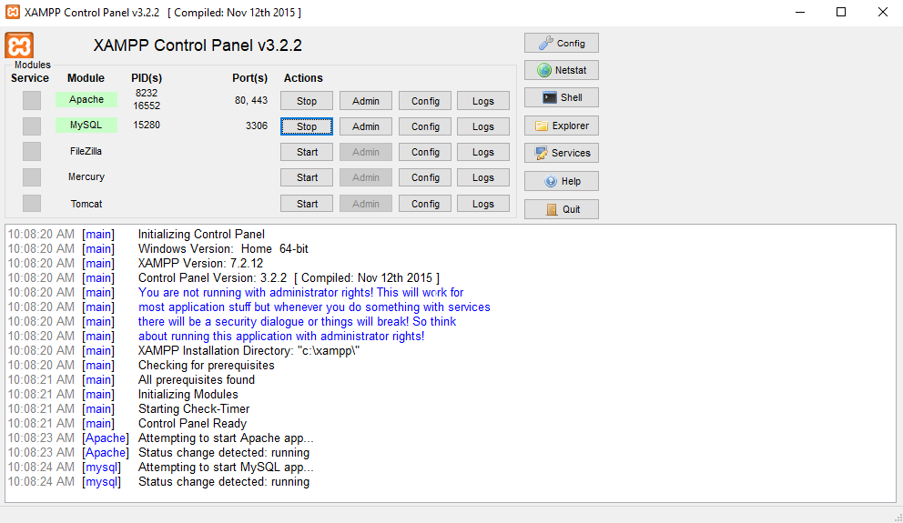
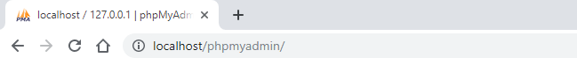
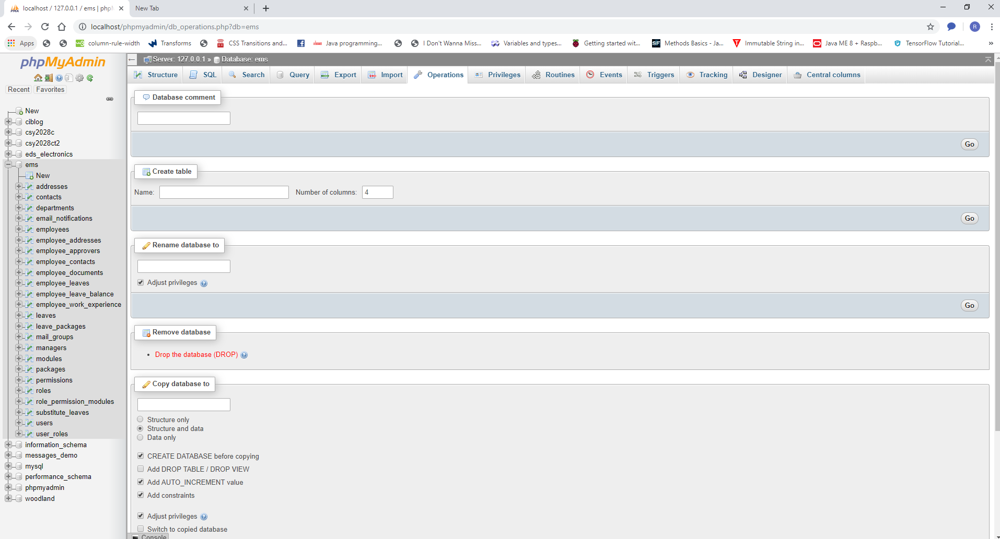
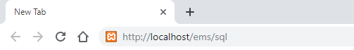
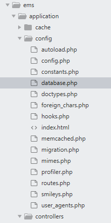
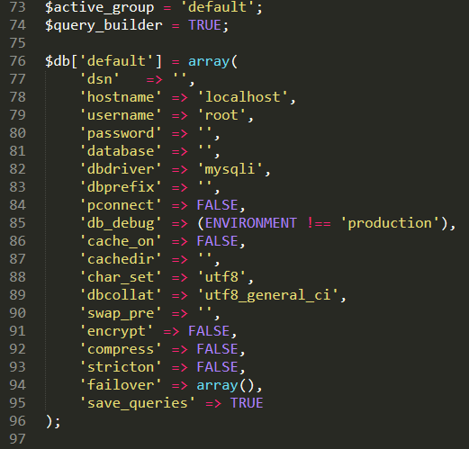
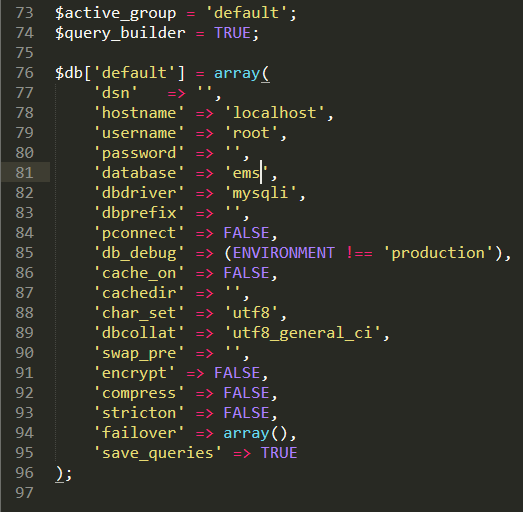

###################
What is EMS
###################

An Employee Management System is designed to simplify the process of record 
maintenance of employees in an organisation. This system mainly encompasses 
the process of managing employee details and their Leave Request Management.
Managing Employee details refers to the overall process of adding a employee to
an organasation, allocating them to certain department, assign Leave Package 
according to their designation, editing and archiving those details whereas
Leave Management bounds the processes employees use to request time away 
from work and supervisors use to grant or deny leave based on organization policies.

*******************
Release Information
*******************

This repo contains in-development code for future releases. To download the
latest stable release please visit the `EMS Releases
<https://github.com/RojenTmg/ems/releases>`_ page.

.. **************************
.. Changelog and New Features
.. **************************

.. You can find a list of all changes for each release in the `user
.. guide change log <https://github.com/bcit-ci/CodeIgniter/blob/develop/user_guide_src/source/changelog.rst>`_.

*******************
Server Requirements
*******************

PHP version 5.6 or newer is recommended.

It should work on 5.3.7 as well, but we strongly advise you NOT to run
such old versions of PHP, because of potential security and performance
issues, as well as missing features.

************
Installation
************

**HOW TO OPEN XAMPP AND COPY FOLDER**

1. | Make sure to have Xampp installed on you PC. If not, first install it.
   | Please see `XAMPP Installation Process <https://www.wikihow.com/Install-XAMPP-for-Windows>`_ for further details. 
2. Copy the 'ems' folder in the 'C:\xampp\htdocs' folder.
3. First open the Xampp Control Panel and start Apache and MySQL.

**SETUP DATABASE AND START USING EMS**

1. Open the browser and type 'http://localhost/phpmyadmin/'.

2. Check if there is "ems" database already created.

3. If the ems database does not exists, go to step 5.
   Or else,
   Make sure to drop the database "ems" if it already exits.

4. To drop the database, click on "ems", go to 'operations' tab and click "Drop the database (DROP)" option.

5. Go to the browser and open '[url]/sql'. (example: localhost/ems/sql)
[This will create database and hash the admin's password in the database]

6. Open the ems folder in the text editor (example: sublime).
   Then open database.php located at, ems > application > config > database.php

7. In the file 'database.php', go to  line 81, or where you can see 'database' => ''.

8. There, change 'database' => '' to 'database' => 'ems' .

9. The setup is completed.

10. Open the login page and login with the provided user id and password given below.
	The password needs to be changed to be able to use the EMS.

***************************
Login Credentials for Admin
***************************

| User id: 276
| Password: Nepal@123

*******
License
*******

Please see the `license
agreement <https://github.com/bcit-ci/CodeIgniter/blob/develop/user_guide_src/source/license.rst>`_.

.. *********
.. Resources
.. *********

.. -  `User Guide <https://codeigniter.com/docs>`_
.. -  `Language File Translations <https://github.com/bcit-ci/codeigniter3-translations>`_
.. -  `Community Forums <http://forum.codeigniter.com/>`_
.. -  `Community Wiki <https://github.com/bcit-ci/CodeIgniter/wiki>`_
.. -  `Community Slack Channel <https://codeigniterchat.slack.com>`_

.. Report security issues to our `Security Panel <mailto:security@codeigniter.com>`_
.. or via our `page on HackerOne <https://hackerone.com/codeigniter>`_, thank you.

***************
Acknowledgement
***************

The EMS team would like to thank NAMI college, all the
contributors to the EMS project and you, the EMS user.

